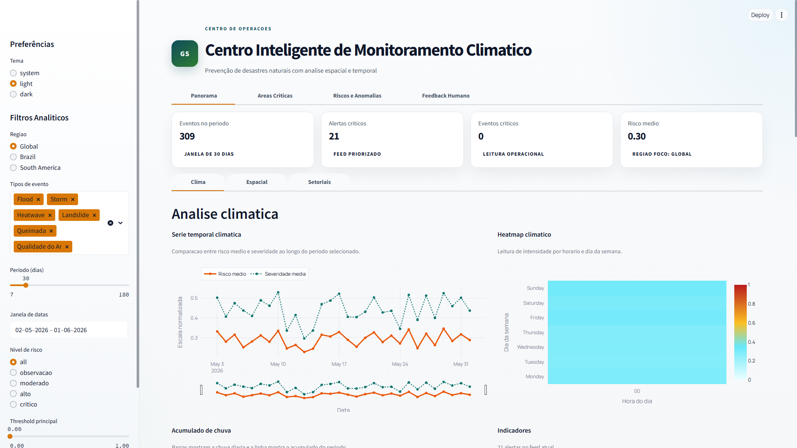
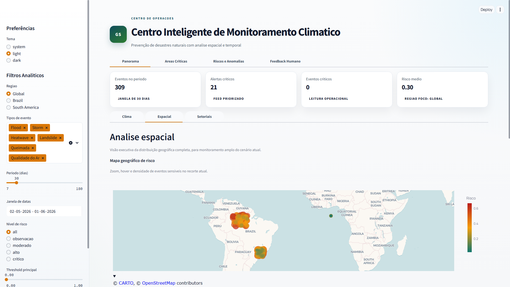
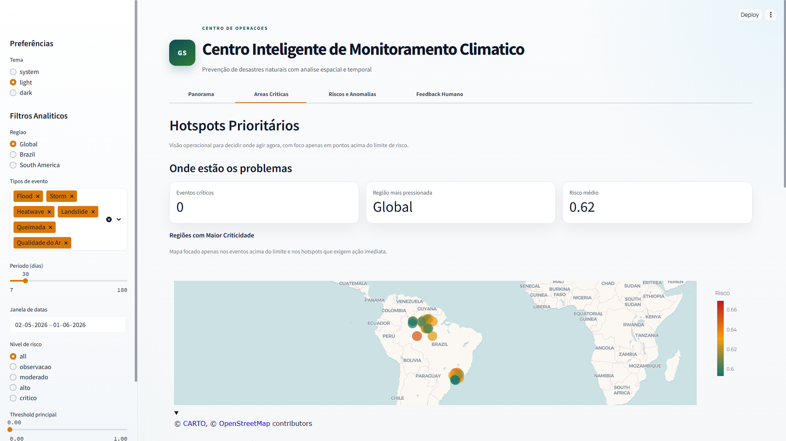
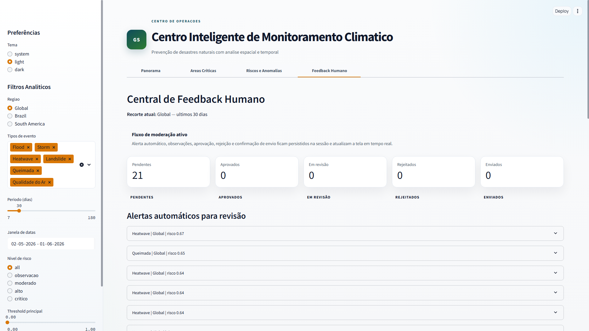
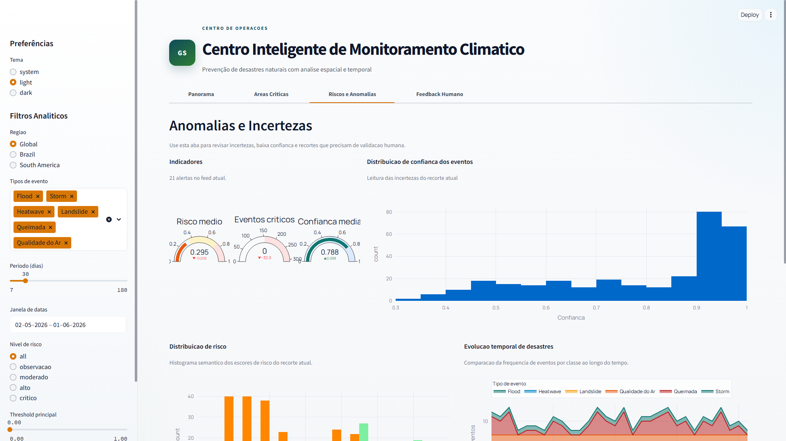

# GS Front - Centro Inteligente de Monitoramento Climático

Solução Streamlit para monitoramento operacional de eventos climáticos, leitura espacial de risco e apoio à decisão com validação humana.

## Problema

Sistemas de Previsão Climática e Prevenção de Desastres Naturais com Base em Dados Espaciais exigem uma visão única para transformar dados ambientais dispersos em informação operacional útil.

Na prática, a equipe precisa:

- enxergar eventos por região, período e tipo;
- identificar áreas críticas e níveis de risco;
- acompanhar tendências e indicadores de qualidade do ar;
- validar alertas antes de tratá-los como ação operacional.

## Solução

Esta plataforma organiza dados ambientais simulados em um dashboard operacional com filtros reativos, KPIs, mapas, gráficos e um fluxo de feedback humano.

O objetivo é apoiar monitoramento e tomada de decisão com uma leitura clara do contexto atual, priorização visual de alertas e revisão manual dos eventos mais sensíveis.

Hoje, a interface principal expõe quatro áreas operacionais:

- Panorama
- Áreas Críticas
- Riscos e Anomalias
- Feedback Humano

## Funcionalidades

- Dashboard climático com KPIs e visão executiva do recorte atual.
- Monitoramento geoespacial com mapas, densidade e dispersão de eventos.
- Áreas críticas com priorização visual de alertas e regiões sensíveis.
- Previsão operacional de riscos baseada em scores heurísticos do contexto atual.
- Qualidade do ar com série temporal e índice agregado.
- Feedback humano com aprovação, rejeição e confirmação de envio.
- Alertas priorizados e distribuição espacial de eventos críticos.
- KPIs de operação, risco e volume de eventos.
- Visualizações interativas com Plotly.

## Arquitetura

O projeto segue uma organização modular inspirada em Clean Architecture, com separação entre estado, regras de negócio, visualização e composição de interface.

- Streamlit: camada de interface e navegação por abas.
- Plotly: visualizações interativas para mapas, séries, dispersões e distribuições.
- Session State: persistência do estado da sessão, filtros, preferências e feedback.
- Providers: adaptadores de dados. O fluxo ativo usa providers mockados por padrão; os providers HTTP existem como scaffold.
- Pipelines: ingestão, limpeza, enriquecimento, scoring e geração de alertas.
- Features: módulos verticais com domínio, DTOs, seletores, services e use cases.
- Componentes reutilizáveis: cards, banners, filtros, header, footer, wrappers de gráficos e estados vazios.

### Fluxo de alto nível

1. `app.py` inicializa a sessão e aplica o tema global.
2. O shell monta a navegação principal e renderiza as páginas.
3. O sidebar aplica filtros e atualiza o contexto operacional.
4. Os pipelines constroem o dataset enriquecido e o feed de alertas.
5. As features e os charts consomem esse contexto e geram a interface.

## Estrutura do Projeto

```text
.
├── app.py
├── providers/
├── pipelines/
├── features/
├── state/
├── ui/
├── tests/
├── screenshots/
├── Dockerfile
├── pyproject.toml
├── requirements.txt
└── .github/workflows/ci.yml
```

## Screenshots

As imagens abaixo usam os arquivos atualmente presentes em `screenshots/real/`.

### Dashboard geral



Visão inicial com KPIs, navegação por abas e leitura executiva do período selecionado.

### Panorama espacial



Mapa com a distribuição espacial dos eventos e a concentração do recorte ativo.

### Áreas críticas



Leitura espacial de alertas e priorização operacional para identificar regiões que exigem atenção imediata.

### Feedback humano



Workbench de moderação com revisão de alertas, observações e confirmação de envio.

### Previsões climáticas



Séries e leituras operacionais de risco calculadas a partir do contexto atual.

## Tecnologias

- Python
- Streamlit
- Plotly
- Pandas
- Pytest
- Docker
- GitHub Actions

## Como Executar

### Instalação

```powershell
python -m venv .venv
.\.venv\Scripts\Activate.ps1
python -m pip install --upgrade pip
pip install -r requirements.txt
```

### Execução local

```powershell
streamlit run app.py
```

Depois, abra `http://localhost:8501` no navegador.

### Docker

```bash
docker build -t gs-front:latest .
docker run -it --rm -p 8501:8501 gs-front:latest
```

## Testes

Para executar toda a suíte:

```bash
pytest -q
```

Para rodar os grupos principais explicitamente:

```bash
pytest tests/unit tests/integration tests/e2e -q
```

## Diferenciais

- Arquitetura modular
- Human-in-the-loop
- Visualizações geoespaciais
- Cache inteligente
- Dashboard interativo
- Storytelling analítico
- Docker
- CI/CD com GitHub Actions para lint, type check, testes e build de imagem

## Limitações Atuais

- Os dados exibidos pelo app são simulados ou mockados por padrão.
- As previsões operacionais usam scores heurísticos, não modelos de machine learning.
- Não há integração ativa com fontes externas em tempo real no fluxo padrão.
- Os providers HTTP existem como scaffold, mas não estão conectados a uma API real no estado atual do projeto.

## Melhorias Futuras

- Conectar providers reais com autenticação, retry e tratamento de erro.
- Evoluir os scores heurísticos para modelos preditivos validados.
- Persistir histórico operacional em banco externo.
- Ampliar observabilidade com métricas e logs estruturados.
- Automatizar deploy para ambientes de homologação e produção.
- Expandir a cobertura de testes end-to-end.

## Equipe

- Henry Gimenez - 563217
- Matheus Mikio - 561864
- Gustavo Balbo - 561711